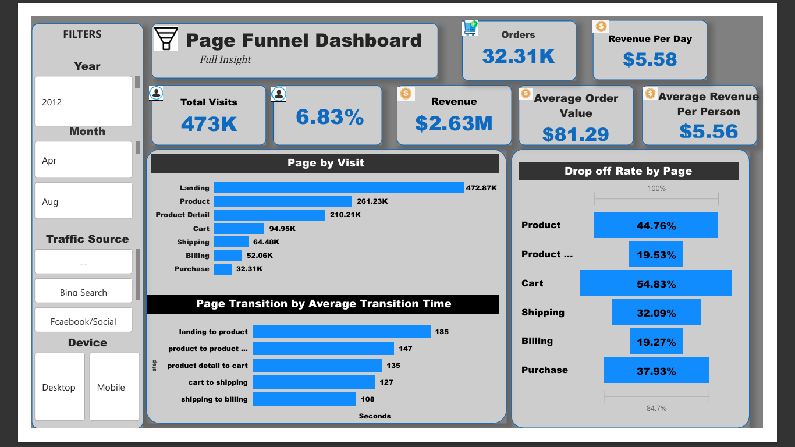

# Customer Retention & Revenue Analysis  
SQL • Power BI • Excel • Cohort Analysis • Funnel Optimization

---

## Overview
This project analyzes customer behavior across the purchase funnel and retention lifecycle for an e-commerce platform (Mr Fuzzy Teddy Bear Store).  

The goal is to identify:
- Funnel drop-off points
- Customer churn behavior
- Revenue leakage opportunities
- Retention improvement strategies

---

## Data Source
This project uses a public dataset from Maven Analytics as part of a data analytics challenge.

Source: https://www.mavenanalytics.io/data-playground

---

## Business Problem
In the 2012–2015 e-commerce dataset for **Mr Fuzzy Teddy Bear Store**, significant drop-offs in the purchase funnel (especially Product Detail → Cart) and high customer churn were causing major revenue leakage.

---

## Objectives
- Identify where users drop off in the funnel  
- Analyze conversion efficiency across funnel stages  
- Segment performance by product, device, and traffic source  
- Measure customer retention and churn behavior  
- Estimate revenue impact of conversion losses and churn  

---

## Tools & Technologies
- SQL → Data extraction, cleaning, joins, segmentation  
- Excel → Data validation and inspection  
- Power BI → Dashboards, funnel visualization, cohort analysis, KPI reporting  
- Analytics Methods → Funnel Analysis, Cohort Analysis, Segmentation, ROI Estimation  

---

## Core Skills Demonstrated
- SQL data transformation and funnel structuring  
- Power BI dashboard development and DAX measures  
- Cohort retention analysis and churn modeling  
- Funnel optimization and conversion analysis  
- Business impact estimation and revenue analytics  

---

## Solution Approach

### 1. Funnel Analysis
Built a complete customer journey funnel:

Landing → Product Page → Product Detail → Cart → Shipping → Billing → Purchase  

---

### 2. Segmentation Analysis
Performance was analyzed across:
- Product types  
- Device type  
- Campaign traffic sources  

---

### 3. Cohort Retention Analysis
Extended analysis into customer retention behavior to measure:
- Churn rate  
- Repeat purchase behavior  
- Customer lifecycle patterns  

---

## SQL Data Preparation (Sample)

```sql
funnel AS (
SELECT 
    DISTINCT website_session_id,

    MAX(CASE WHEN pageview_url IN (
        '/home','/lander-1','/lander-2','/lander-3','/lander-4','/lander-5'
    ) THEN rn END) AS landing,

    MAX(CASE WHEN pageview_url = '/products' THEN rn END) AS product,

    MAX(CASE WHEN pageview_url IN (
        '/the-birthday-sugar-panda',
        '/the-forever-love-bear',
        '/the-hudson-river-mini-bear',
        '/the-original-mr-fuzzy'
    ) THEN rn END) AS product_detail,

    MAX(CASE WHEN pageview_url = '/cart' THEN rn END) AS cart,

    MAX(CASE WHEN pageview_url = '/shipping' THEN rn END) AS shipping,

    MAX(CASE WHEN pageview_url IN ('/billing','/billing-2') THEN rn END) AS billing,

    MAX(CASE WHEN pageview_url = '/thank-you-for-your-order' THEN rn END) AS purchase

FROM step 
GROUP BY 1
)
```
[View live funnel SQL codes for Power Bi Reporting](SQL/Main-Funnel-Code.sql)

[View live chort retention SQL codes for Power Bi Reporting](SQL/cohort-retention.sql)

---

## Insights Dashboard View




[](images/drop-Off-segment.png)


[](images/funnel-optimization.png)


## Key Metrics & Findings

### Funnel Performance
- Product Detail Reach: **210.21K**
- Cart Reach: **94.95K**
- Users Lost: **115.3K**
- Drop-off Rate: **54.83%**
- Estimated Revenue Loss: **$3.19M**

---

### Product-Level Drop-off
- Mr Fuzzy: **56.96%**
- Sugar Panda: **53.74%**
- Hudson River: **34.87%**

---

### Campaign Source Impact
- Google Search: **54.93% drop-off**

---

### Device Performance
- Desktop: **53.95%**
- Mobile: **57.88%**

---

## Cohort Retention Analysis
- Overall Churn Rate: **88.87%**
- Estimated Revenue Loss from Churn: **$2.29M**
- Repeat Purchase Rate: **1.86%**
- Median Time to Repeat Purchase: **31 days**

## Insights Dashboard View


[live link to full report]()
---

## Business Impact & Recommendations

A **10% improvement in Product → Cart conversion** could generate:
- **$581K additional revenue**
- **7,154 additional orders**

---

## Key Insights
- Major funnel leakage occurs at Product Detail → Cart stage
- Mr Fuzzy products and Google Search traffic are the highest-value drop-off points
- High churn indicates weak retention and engagement issues

---

## Recommendations
- Improve Product Detail UX (images, reviews, pricing clarity)
- Optimize Google Search landing experience through A/B testing
- Implement cart abandonment recovery strategies (email/SMS incentives)
- Develop retention strategies for high-churn cohorts

---

## Overall Business Impact
- **Project 1**: Landing page optimization → **$1.18M potential recovery**
- **Project 2**: Funnel + churn optimization → **$5.48M+ combined opportunity**

---

## Conclusion
This project demonstrates the ability to transform raw data using SQL, build KPI-driven dashboards in Power BI, and generate revenue-focused insights through funnel and cohort analysis.


## 📚 Next Step: Python Learning Path

To further strengthen my analytics and data engineering skill set, the next focus areas include:

- Python for data analysis (Pandas, NumPy)  
- Data visualization (Matplotlib, Seaborn)  
- Predictive modeling (Scikit-learn)  
- Healthcare risk scoring models  
- API and data pipeline development  

This will enable a transition from descriptive analytics to **predictive healthcare analytics**.

---

## 🤝 Open to Opportunities

I am actively seeking opportunities in:

- Data Analyst roles (Entry-Level / Graduate / Junior)  
- Healthcare Analytics roles  
- Business Intelligence (BI) Analyst positions  
- Data Engineering Internships  
- Graduate Trainee Programs  

I am open to remote, hybrid, and on-site opportunities where I can contribute to data-driven decision-making and continue developing technical expertise.

---

## 📬 Contact

**Ike Ernest**  
Data Analyst | SQL | Power BI | Healthcare Analytics  

- GitHub: [github.com/ikeernest4700-lab]  
- LinkedIn: [https://www.linkedin.com/in/emeka-ike-108748198]  
- Email: [ikeernest4700@gmail.com]  


---

## Contact
- LinkedIn: https://www.linkedin.com/in/emeka-ike-108748198/
- Email: ikeernest4700@gmail.com
- Open to entry-level Data Analyst roles, collaborations, or feedback
